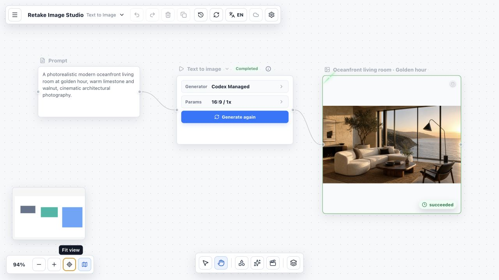
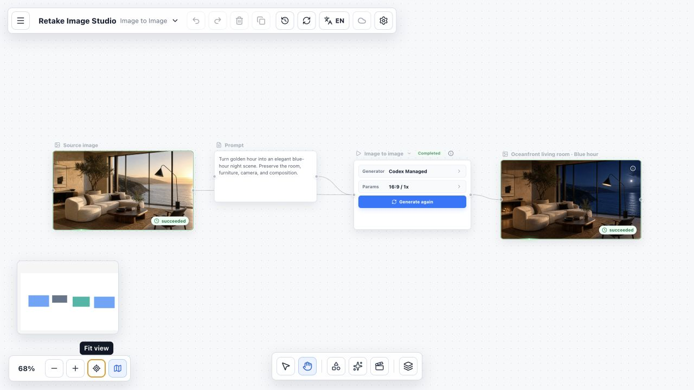
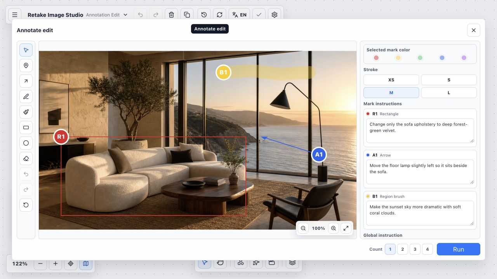
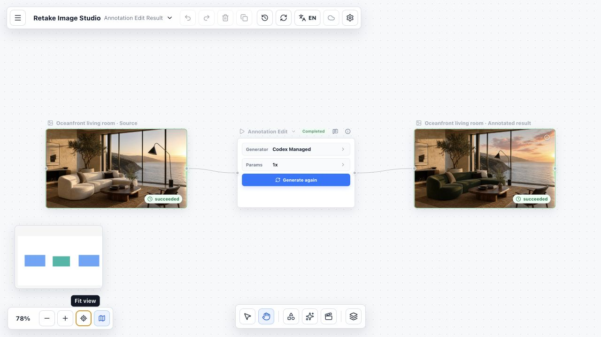

# Retake Whiteboard

[简体中文](./README.zh-CN.md)

Retake Whiteboard is an infinite-canvas workspace for Retake video creation
workflows. The current MVP focuses on the image stage: image blocks,
annotation-driven image edits, and Codex/MCP execution and writeback.

## Current Scope

The image-stage MVP includes:

- text-to-image and image-to-image Operation flows;
- annotation-driven edits with visual marks and per-mark instructions;
- one to four pre-created result Blocks with progressive writeback;
- Project, Board, Asset, Execution, Group, and lightweight History records;
- Codex/MCP execution through the same data model intended for future direct
  API Adapters.

Video generation, hosted collaboration, direct provider APIs, and dynamic
plugin discovery are not complete product flows yet.

## Requirements

- Node.js 20.19 or later (22.12 or later when using Node.js 22);
- npm;
- Codex CLI with Codex Plugin support;
- a real image generation or editing capability available to Codex.

The Retake plugin reads Operations, assembles execution context, and writes
results back. It does not provide an image generation model by itself.

## Installation

### Ask Codex to install it (recommended)

Send the following prompt to Codex:

```text
Install the Retake Whiteboard Codex plugin from
https://github.com/retake-tools/whiteboard.git.

Clone the repository into ~/src/retake-whiteboard, run npm install,
then run npm run mcp:test and npm run codex:install.

The codex:install command must build the web app and start its background
production server. After installation, validate the plugin, Skill, MCP tools,
and production server; tell me to open http://127.0.0.1:18771 and whether I
need to start a new Codex task. Do not copy or modify any user data under the
repository's .retake/ directory.
```

This installs the complete plugin, including the Retake Skill and MCP tools.
Copying only the Skill is not enough because Execution, Asset, and result Block
writeback depends on MCP.

`npm run codex:install` builds the app, installs the Codex plugin, and starts a
background production server. When it finishes, open
<http://127.0.0.1:18771>. Keep the checkout and `node_modules` in place so both
the web app and MCP bridge remain available.

Manage the background server from the checkout with:

```bash
npm run production:status
npm run production:restart
npm run production:stop
```

The background server continues after the installing Codex task exits. After a
computer restart, run `npm run production:start` from the checkout if the
server is not available.

### Manual source setup

```bash
mkdir -p ~/src
git clone https://github.com/retake-tools/whiteboard.git ~/src/retake-whiteboard
cd ~/src/retake-whiteboard
npm install
npm run dev
```

Open <http://127.0.0.1:18770>. This is the foreground development server with
live reload; stop it with `Ctrl+C`.

To add the Codex Plugin after a manual source setup, stop the development
server in that terminal, optionally run `npm run mcp:test`, and then run
`npm run codex:install`. The install command switches to the background
production workflow at <http://127.0.0.1:18771>.

The installer registers this checkout in the default personal Codex
marketplace and stages a minimal plugin package. The package contains only the
manifest, MCP configuration, Skill, startup bridge, READMEs and their
screenshots, and license. It does not copy `.retake/` board data, dependencies,
build output, internal research, or test artifacts into the Codex plugin cache.

Keep the repository checkout outside `~/plugins/retake-whiteboard`. That path
is reserved for the installer-managed minimal plugin source package.

The MCP bridge continues to execute from this checkout. Start a new Codex task
after plugin installation to load the new Skill and MCP tools.

## How to Use It

Retake keeps prompts, source images, Operations, and generated results visible
on one canvas. Create a workflow in the web app, generate the Codex Prompt from
the Operation Block, and let the Retake plugin write the finished image back to
the prepared result Block.

### Text to image

Connect a Text Block to a text-to-image Operation, choose the aspect ratio and
result count, then run it through Codex.



### Image to image

Connect a source Image Block and an edit prompt to preserve the original
composition while changing the requested visual attributes.



### Annotation edit

Draw numbered markers, arrows, freehand strokes, region brushes, rectangles, or
ellipses directly over the source image. Give each mark its own instruction and
optionally add one global instruction before running the edit.



After Codex completes the Operation, the clean source, Annotation Edit
Operation, and generated result remain connected on the canvas. In this
example, the sofa becomes forest-green velvet, the floor lamp moves beside the
sofa, and coral clouds are added without changing the room composition.



## Local Development

Install dependencies and start the web app:

```bash
npm install
npm run dev
```

The development server starts at `http://127.0.0.1:18770` by default.

Board content is stored locally under `.retake/`, which is ignored by Git. Do
not edit snapshot JSON files directly; use the whiteboard UI, local service, or
MCP tools so Asset and Execution lineage stays consistent.

For a stable release-style preview port separate from daily development, use:

```bash
npm run production
```

This builds the app and starts the production preview at
`http://127.0.0.1:18771`. `npm run preview` remains the Vite-compatible alias
for previewing an existing `dist/` directory.

## Codex Workflow

1. Start the Retake Whiteboard web app and create or open a Project and Board.
2. Create a text-to-image, image-to-image, or annotation-edit Operation.
3. On first use, bind the current Codex workspace to that Retake Project and
   Board.
4. Generate the Codex Prompt from the Operation Block and run it in a new Codex
   task.
5. Codex uses a real image capability to generate or edit the image, then
   writes the Asset, Execution, and result Blocks back through Retake MCP tools.

`Codex Managed` is the built-in execution profile and does not require a
separate model provider or API key. The current Codex environment must still
provide a real image generation or editing capability. Direct API, ACP, and
third-party model profiles are optional user-local settings and are not
distributed with project defaults.

Codex is one execution route, not the Retake backend. The plugin is an
execution and packaging layer, while the standalone web app remains the main
product surface. Future direct API, hosted web, and commercial versions can
therefore share the same Project, Board, Asset, and Execution model.

## Verification

```bash
npm run typecheck
npm run build
npm run mcp:test
npm run plugin:package:test
npm run production:test
npm run skill:validate
```

`npm run mcp:test` must run sequentially because contract tests share and reset
the ignored `.retake-test/` workspace; it does not reset the real `.retake/`.
Visual or interactive changes should also be tested in a clearly named
disposable Project and Board rather than an existing user Board.

## Architecture Boundaries

- `Block` owns user-visible canvas state and placement.
- `AssetRecord` owns asset metadata and storage references.
- `ExecutionRecord` owns one capability run, including route, status, inputs,
  outputs, provider/model metadata, and errors.
- `Plugin` defines capabilities; an `Adapter` executes them; a `Skill` defines
  compatible creative or process behavior.
- The canvas coordinates workflows but does not own provider-specific logic.

MCP writeback and future direct API execution must converge on the same Asset
and Execution records.

## Contributing

See [CONTRIBUTING.md](./CONTRIBUTING.md) for repository boundaries,
verification, and safe UI testing guidance.

## License

Retake Whiteboard is available under the [MIT License](./LICENSE).
