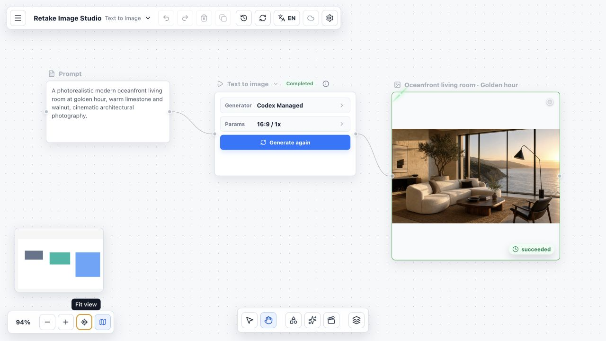
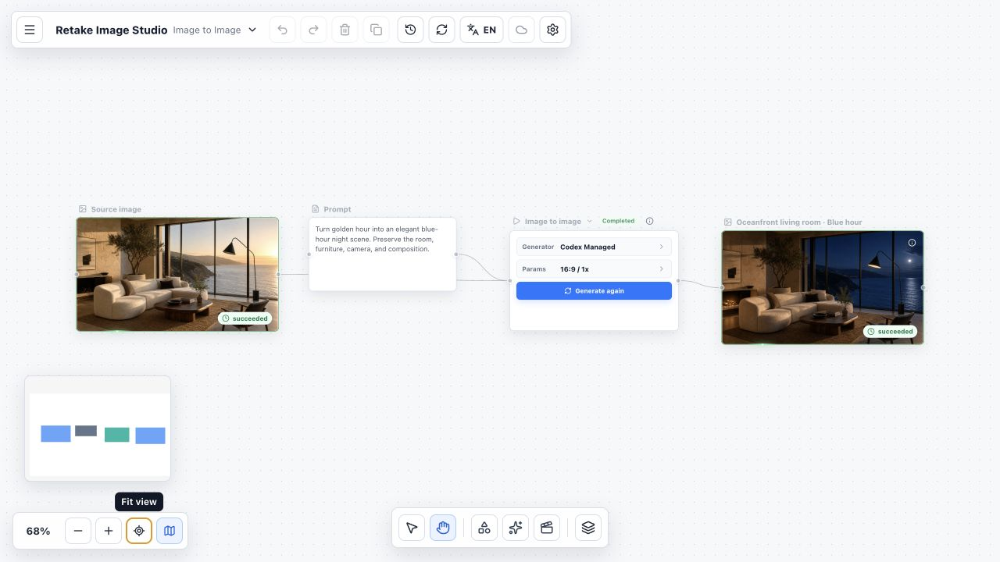
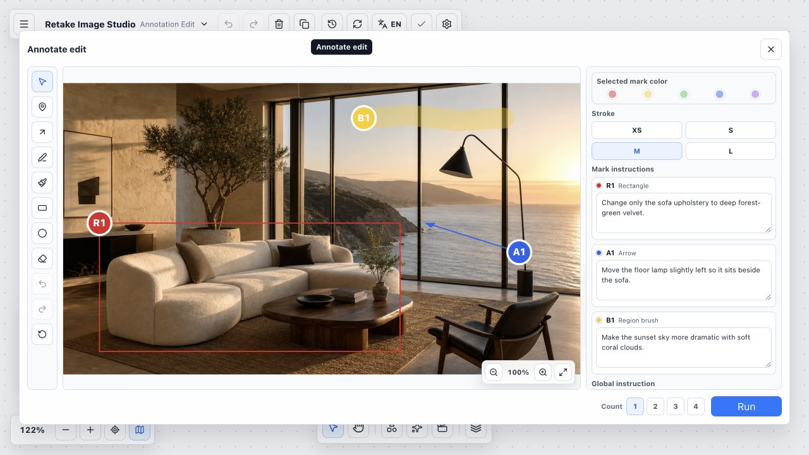
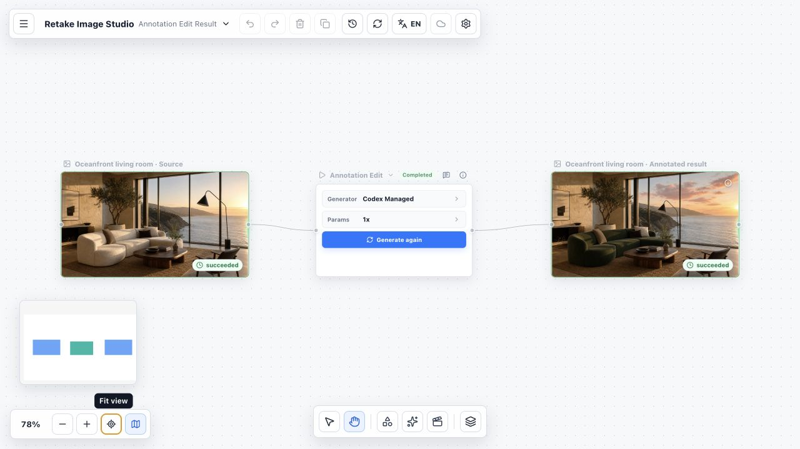

# Retake Whiteboard

[English](./README.md)

Retake Whiteboard 是面向视觉生产的 local-first 无限画布。它把自由画板、Package / Plugin Host、
Workflow Runtime、Agent Workspace，以及统一的 Asset / Execution / Artifact 历史放在同一产品中。

## 当前版本

Retake Whiteboard `0.1.3` 已包括：

- 基于自由无限画布的 Project / Board 管理；
- 统一的 `image.generate` Operation，支持文字起图、原图派生、多参考图、一至四个结果与再次生成；
- 官方 Image Studio Package，包括标注、调整、裁剪、缩放、扩图，以及 Guided Image Skill、
  Workflow 和 AgentPreset；
- GitHub Source 安装与更新、exact-version cache、回滚、隔离、分项权限和 Project / Board 启用；
- 可持久化 Workflow Run、Gate、输出选择、Artifact、History，以及支持 Codex App Server 和
  已配置 Direct API Runtime 的 Agent Workspace；
- Codex Plugin 与 MCP 写回，并和其他执行通道共用 Project、Board、Asset、Execution 与
  Artifact 模型。

本版本的官方离线 bootstrap **只包含 Image Studio**。Video Studio 不会默认打包或启用；既有安装
和可选的 GitHub Source 安装仍然可用。Provider 凭据与付费调用始终由用户自行配置，不随
Whiteboard 分发。

## 环境要求

- canonical 开发、CI 与发布构建使用 Node.js 24.18.0；
- Node.js 22.12 或更高版本继续作为兼容运行时。Node.js 26 在进入 LTS 且 Package
  归档 codec 与运行时解耦前仅作实验性验证；
- npm；
- 使用 Codex/MCP 通道时，需要安装支持 Codex Plugin 的 Codex CLI；
- Codex 环境中可用的真实图片生成或编辑能力。

Retake 插件负责读取 Operation、组织执行上下文和写回结果，不会自行提供图片生成模型。

## 安装

### 让 Codex 自动安装（推荐）

把下面这段发给 Codex：

```text
请从 https://github.com/retake-tools/whiteboard.git 安装 Retake Whiteboard Codex 插件。

请 clone 仓库到 ~/src/retake-whiteboard，运行 npm install，
再运行 npm run mcp:test 和 npm run codex:install。

codex:install 命令必须构建 Web App 并启动后台 production 服务。安装完成后请校验插件、
Skill、MCP 工具和 production 服务，告诉我打开 http://127.0.0.1:18771，并说明是否需要
开启一个新的 Codex 任务。不要复制或修改仓库中的 .retake/ 用户数据。
```

上面的提示会跟随持续移动的 `main` 发布通道。如果需要可复现的当前版本，请固定 clone
`v0.1.3`：

```bash
git clone --branch v0.1.3 --depth 1 \
  https://github.com/retake-tools/whiteboard.git ~/src/retake-whiteboard
```

这会安装包含 Retake Skill 和 MCP 工具的完整插件。仅复制 Skill 不足以运行完整流程，
因为 Execution、Asset 和结果 Block 都需要通过 MCP 写回。

`npm run codex:install` 会构建 Web App、安装 Codex Plugin，并启动后台 production 服务。
命令完成后请打开 <http://127.0.0.1:18771>。请保留 checkout 和 `node_modules`，以便网页与
MCP bridge 持续可用。

可以在 checkout 中管理后台服务：

```bash
npm run production:status
npm run production:restart
npm run production:stop
```

安装 Codex 的任务结束后，后台服务仍会继续运行。电脑重启后如果服务不可访问，请在
checkout 中运行 `npm run production:start`。

### 手动源码安装

```bash
mkdir -p ~/src
git clone https://github.com/retake-tools/whiteboard.git ~/src/retake-whiteboard
cd ~/src/retake-whiteboard
npm install
npm run dev
```

然后打开 <http://127.0.0.1:18770>。这是带热更新的前台开发服务，可用 `Ctrl+C` 停止。

如果手动源码安装后还要加入 Codex Plugin，请先停止该终端中的开发服务，可选运行
`npm run mcp:test`，再运行 `npm run codex:install`。安装命令会切换到后台 production
流程，并使用 <http://127.0.0.1:18771>。

安装脚本会把此 checkout 注册到默认的 personal Codex marketplace，并制作一个最小插件包。
该插件包只包含 manifest、MCP 配置、Skill、启动桥接脚本、README 及其截图和许可证；不会把
`.retake/` 白板数据、依赖、构建产物、内部调研或测试产物复制到 Codex 插件缓存。

仓库 checkout 不要放在 `~/plugins/retake-whiteboard`；该路径保留给安装器管理的最小插件源包。

MCP bridge 仍从此 checkout 执行。安装 Plugin 后请新建一个 Codex 任务，以加载新的 Skill
和 MCP 工具。

## 如何使用

Retake 会把提示词、原图、Operation、生成结果、Workflow Run 与 Agent 活动保留在同一个 Board
周围。可以通过 Composer 或画布模板创建 Operation，再交给 Codex App Server、已配置的 Direct
API Runtime，或手动 Codex/MCP 通道执行。

### 文生图

将 Text Block 连接到文生图 Operation，选择画幅比例和结果数量，再交给 Codex 执行。

文生图和图生图只是同一个 `image.generate` Capability 的两种创建模板；是否存在
`source_image` 输入决定具体执行形态。



### 图生图

把原始 Image Block 和修改提示词连接到 Operation，在保留原始构图的同时修改指定的
视觉属性。



### 标注编辑

直接在原图上绘制编号标记、箭头、自由画笔、区域笔刷、矩形或椭圆。每个标记都可以
填写独立修改说明，也可以在执行前补充一条全局说明。



Codex 完成 Operation 后，原图、标注编辑 Operation 和最终结果会继续连接在画布上。本例中，
沙发被改为森林绿色天鹅绒，落地灯移动到沙发旁，并在不改变房间构图的情况下加入珊瑚色云层。



## 本地开发

安装依赖并启动网页：

```bash
npm install
npm run dev
```

开发服务默认运行在 `http://127.0.0.1:18770`。

白板内容保存在 Git 忽略的 `.retake/` 目录中。不要直接修改快照 JSON；应通过白板 UI、
local service 或 MCP 工具操作，以保持 Asset 和 Execution 血缘关系一致。

如需与日常开发端口分离的稳定 release-style preview：

```bash
npm run production
```

该命令会先构建，然后在 `http://127.0.0.1:18771` 启动 production preview。
`npm run preview` 保留为预览已有 `dist/` 的 Vite 兼容别名。

## Codex 使用流程

1. 启动 Retake Whiteboard，并创建或打开一个 Project 和 Board。
2. 创建图片 Operation、选择 Skill / Workflow，或打开一个 Agent Session。
3. 选择已配置的 Runtime；使用手动 Codex/MCP 时，把当前 Codex workspace 绑定到 exact Project
   和 Board。
4. 启动 Operation 或 Agent Task，并查看实时状态、输出和需要人工处理的 Gate。
5. 无论使用哪种执行通道，Retake 都会把结果记录到同一套 Asset、Execution、Block、
   Workflow Run 与 Artifact 血缘中。

`Codex Managed` 是内置的手动 Codex/MCP 配置，不需要在 Retake 中提供独立 Provider Key。
也可以在本地配置 Codex App Server 和兼容的 Direct API Connection。Secret 和付费 Provider
默认值不会随 Project 或官方 Package 分发。

Codex 只是一个执行通道，不是 Retake 的产品后端。独立 Web App 仍是主要产品界面；Codex App
Server、Direct API 和手动 MCP 执行都会汇合到同一套 Project、Board、Asset、Execution、
Workflow Run 与 Artifact 事实。

## 验证

```bash
npm run typecheck
npm run build
npm run mcp:test
npm run plugin:package:test
npm run production:test
npm run skill:validate
```

`npm run mcp:test` 必须顺序运行，因为契约测试共享并重置 Git 忽略的 `.retake-test/`
工作区；它不会重置真实的 `.retake/`。视觉或交互改动还应在命名清晰的临时 Project
和 Board 中验证，不要使用已有的用户 Board。

## 架构边界

- `Block` 管理用户可见的画布状态和位置；
- `AssetRecord` 管理资产元数据和存储引用；
- `ExecutionRecord` 管理一次能力执行，包括 route、status、input、output、
  provider/model 元数据和错误；
- `Plugin` 定义能力，`Adapter` 执行能力，`Skill` 定义可兼容的创作或流程行为；
- Canvas 协调工作流，但不持有 Provider 专属逻辑。

MCP 写回、Codex App Server 和 Direct API 执行汇合到同一套 Asset 与 Execution 记录。

## 参与贡献

仓库边界、验证方式和安全 UI 测试说明请参阅 [CONTRIBUTING.md](./CONTRIBUTING.md)。

## 许可证

Retake Whiteboard 使用 [Apache License 2.0](./LICENSE)，需要保留的署名信息见
[NOTICE](./NOTICE)。
